# HawkEye Lab
---
Q1 : How many packets does the capture have?

Số lượng file là 4003

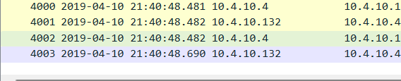

ans : ```4003```

---

Q2 : At what time was the first packet captured?

Để coi ngày tháng theo utc chọn:

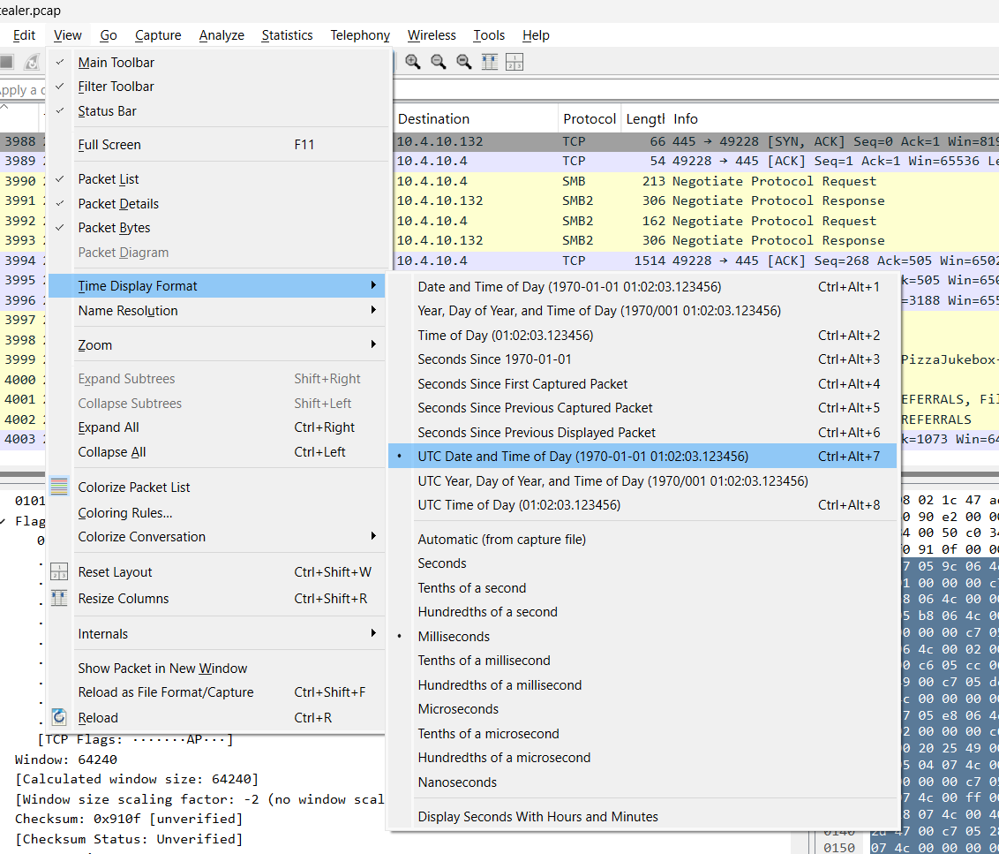

file đầu tiên được cap là: 

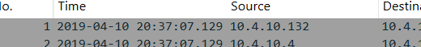

Hoặc là vô đây coi

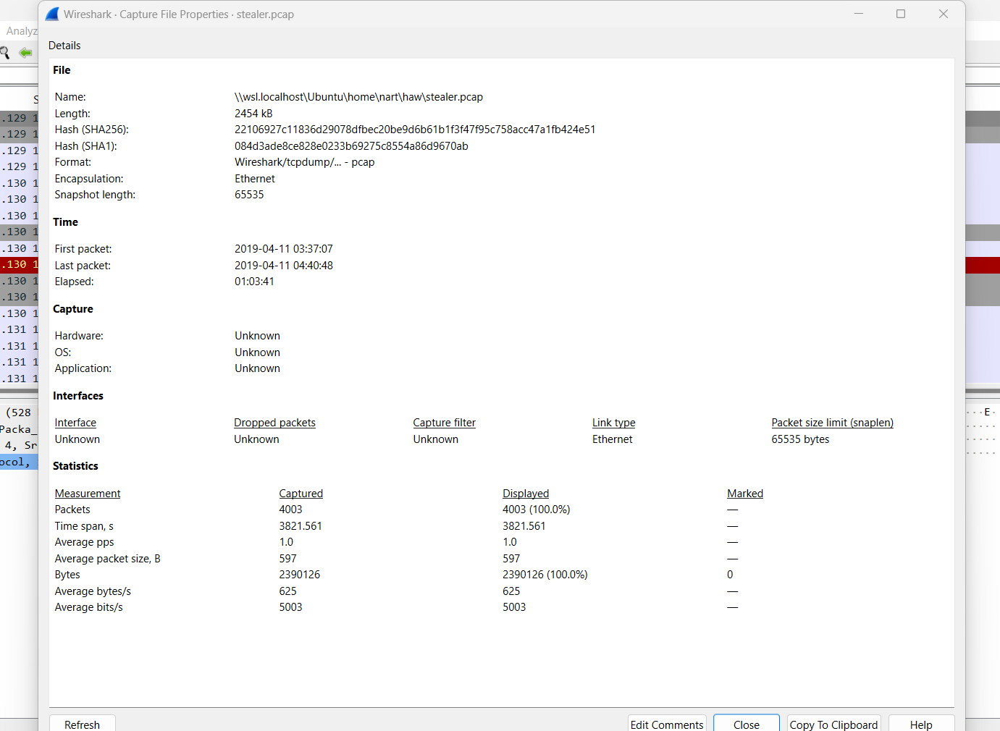

ans : ```2019-04-10 20:37:07 utc```

---

Q3 : What is the duration of the capture?

Để coi thì lấy time cuối cùng - time đầu tiên.

ans : ```01:03:41```

---

Q4 : What is the most active computer at the link level?

Để coi thì vào endpoint, xem cái ethernet mạnh nhất!

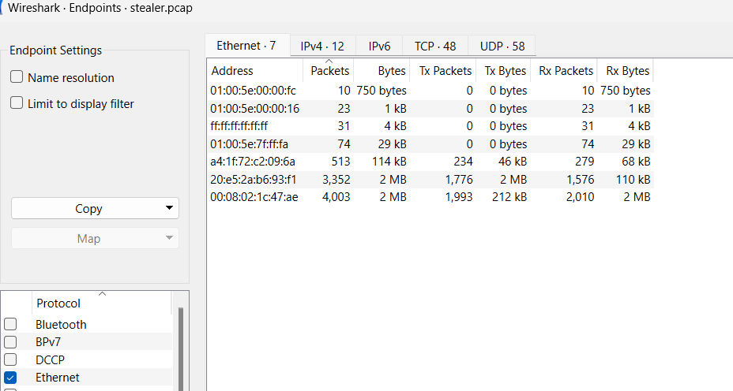

ans : ```00:08:02:1c:47:ae```

---

Q5 : Manufacturer of the NIC of the most active system at the link level?

Chúng ta sẽ lấy link mạnh nhất trong kia để tìm trên [wed](https://www.macvendorlookup.com/).

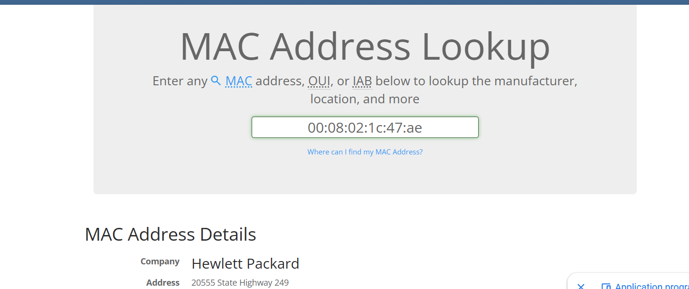

ans : ```Hewlett-Packard```

---

Q6 : Where is the headquarter of the company that manufactured the NIC of the most active computer at the link level?

search gg sẽ cho biết trụ sở chính ở đâu.

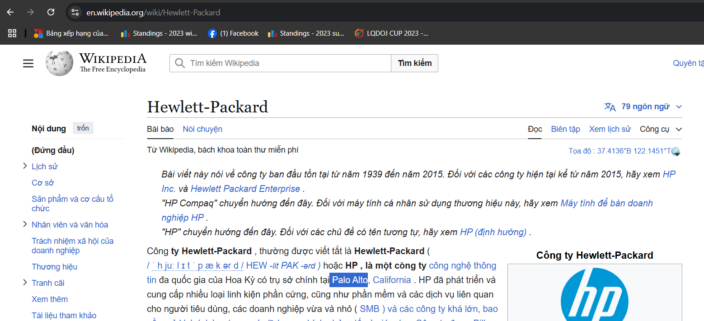

ans : ```Palo Alto```

---

Q7 : The organization works with private addressing and netmask /24. How many computers in the organization are involved in the capture?

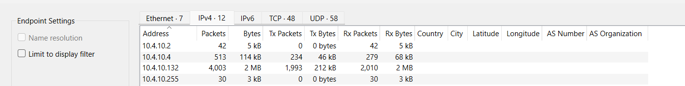

trong IPv4 trong endpoint. Có thể thấy là 4 nhưng có máy là 0 nên là 3

ans : ```3```

---

Q8 : What is the name of the most active computer at the network level?

có thể thấy số ip ở ```10.4.10.132``` là nhiều nhất.

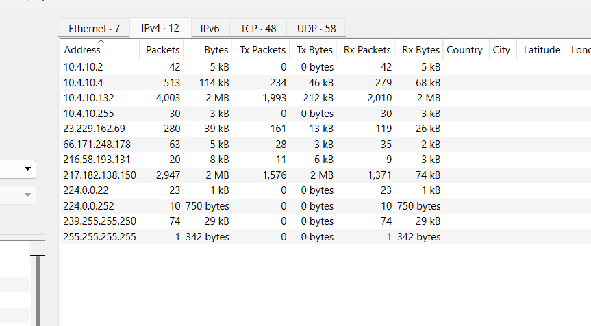

search dhcp của ip thấy đc host name

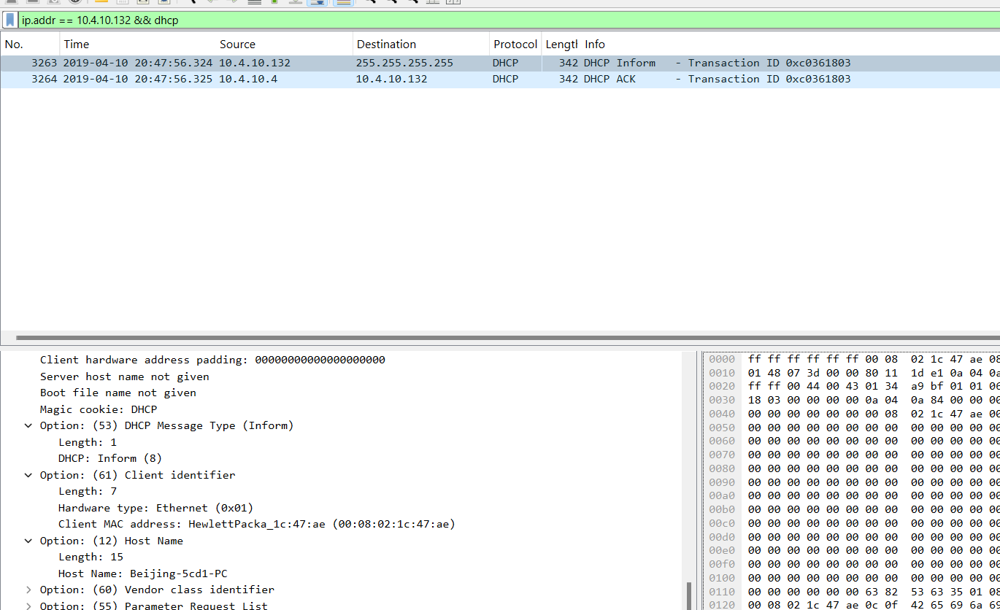

ans : ```Beijing-5cd1-PC```

--- 

Q9 : What is the IP of the organization's DNS server?

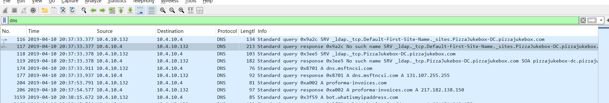

coi theo dns thì có thể thấy 10.4.10.4 là hợp nhất.

ans : ```10.4.10.4```

---

Q10 : What domain is the victim asking about in packet 204?

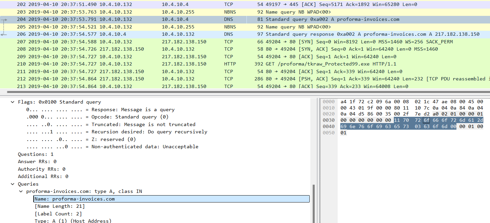

kéo về gói 204 có thể dễ dàng thấy mục tiêu.

ans : ```proforma-invoices.com```

---

Q11: What is the IP of the domain in the previous question?

Kéo xuống dẫn đên tệp 206 và chứa địa chỉ

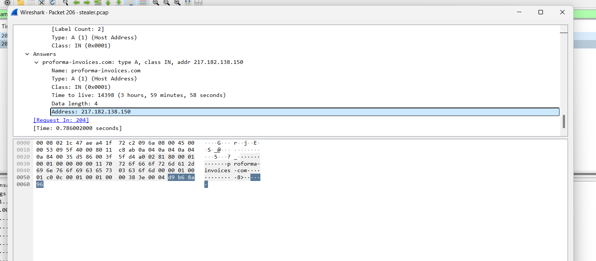

ans : ```217.182.138.150```

--- 

Q12 : Indicate the country to which the IP in the previous section belongs.


lên bất kì ip location nào để coi.
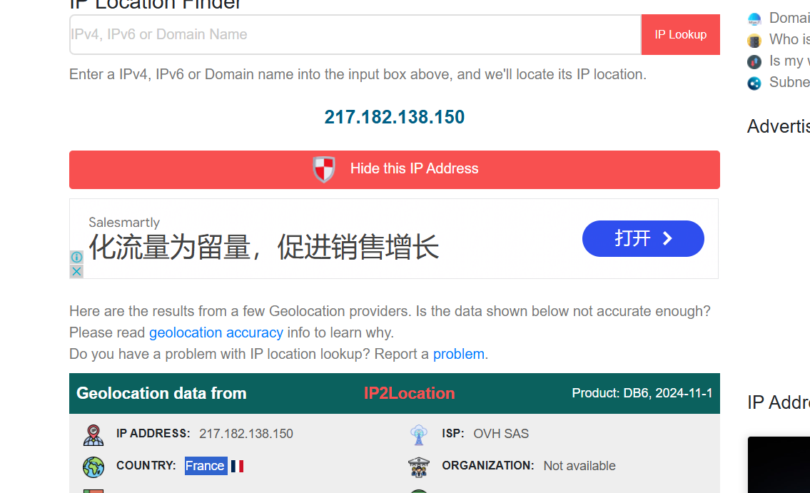

ans : ````France```

---

Q13 : What operating system does the victim's computer run?

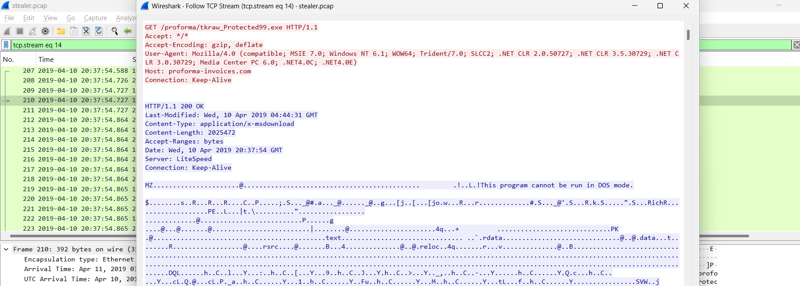

nằm trong khi theo dõi tcp gần cuối.

flag : ```Windows NT 6.1```

---

Q14 : What is the name of the malicious file downloaded by the accountant?

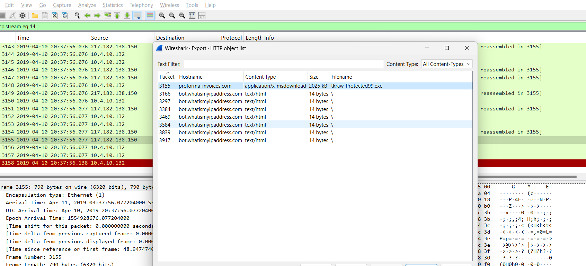

khi tải file tải về được như sau.

ans : ```tkraw_Protected99.exe```

---

Q15 : What is the md5 hash of the downloaded file?

Chỉ việc dùng lênh để tính ra.

```python
╭─   nart   ~/haw                                                                                                              127 ✘  01:54:34 AM  ─╮
╰─❯ md5sum tkraw_Protected99.exe                                                                                                                           ─╯
71826ba081e303866ce2a2534491a2f7  tkraw_Protected99.exe
```
ans : ```71826ba081e303866ce2a2534491a2f7```
---

Q16 : What software runs the webserver that hosts the malware?

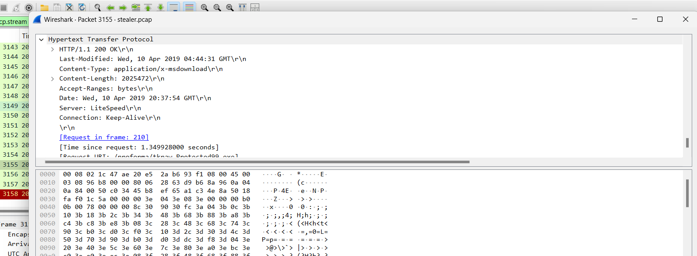

Kiễm tra mã file độc sẽ thấy được sever.

ans : ```Litespeed```

---

Q17 : What is the public IP of the victim's computer?

địa chỉ nạn nhân nằm trong địa chỉ của máy chủ theo lưu lượng get

ans : ```173.66.146.112```

---

Q18 : In which country is the email server to which the stolen information is sent?

search theo vị trí ip người bị hại

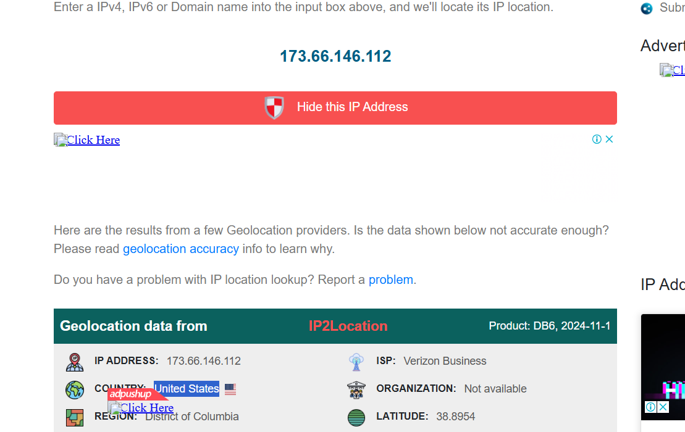

ans : ```United States```

---

Q19 : Analyzing the first extraction of information. What software runs the email server to which the stolen data is sent?

nằm trong TCP khi theo dõi mấy cái này.
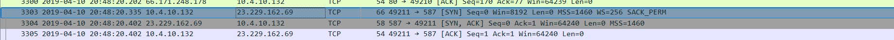

flow nó 

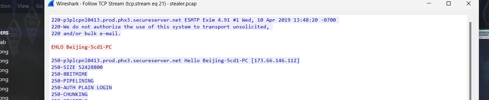

ans : ```Exim 4.91```

---

Q20 : To which email account is the stolen information sent?

Cùng ở trong đó cũng có ghi lại mail gửi đến của hacker

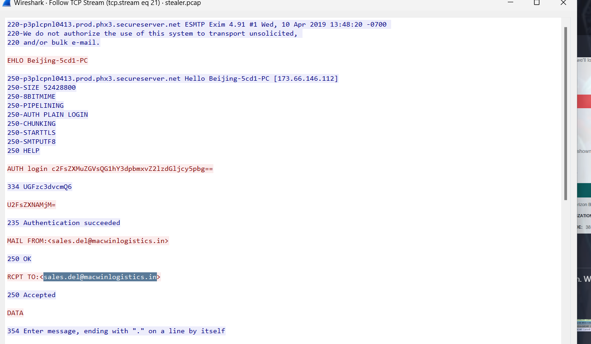

ans : ```sales.del@macwinlogistics.in```

---

Q21 : What is the password used by the malware to send the email?

mật khẩu đc base64 và giấu trong tệp đó.

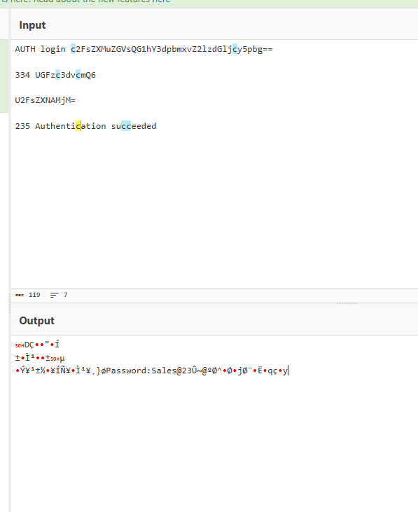

ans : ```Sales@23```

---

Q22 : Which malware variant exfiltrated the data?

Trong mã code đc base64 bên dưới.

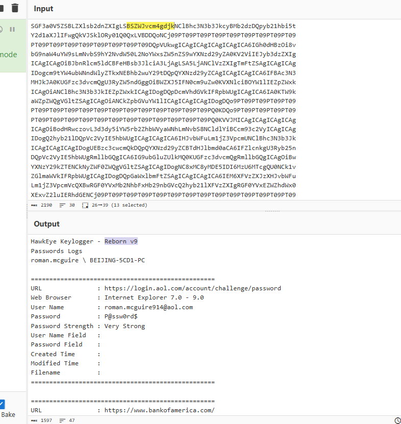

ans : ```Reborn v9```

---

Q23 : What are the bankofamerica access credentials? (username:password)

Vẫn trong đoạn base64 đó

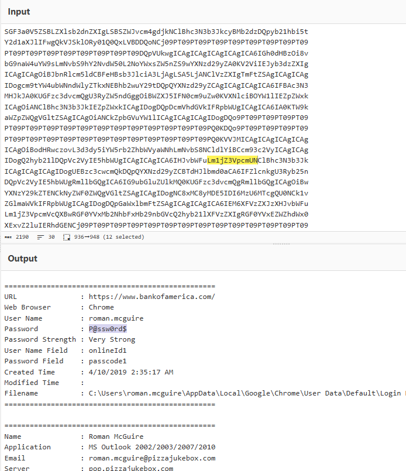

ans : ```roman.mcguire:P@ssw0rd$```

--- 
Q24 : Every how many minutes does the collected data get exfiltrated?

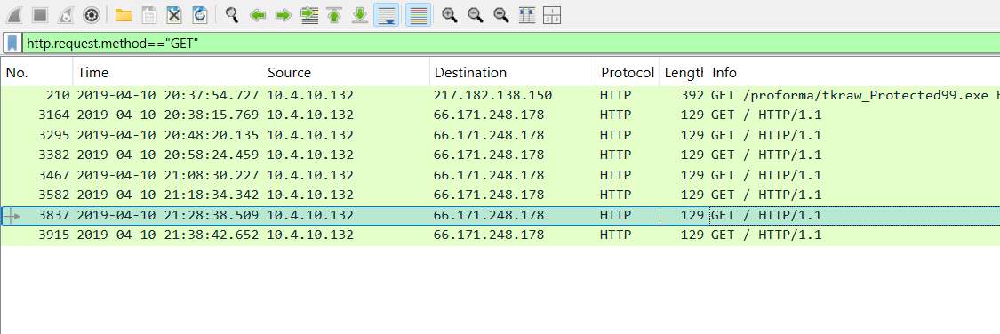

Khi lọc ra chúng ta sẽ thấy 10p 1 lần

ans : ```10```